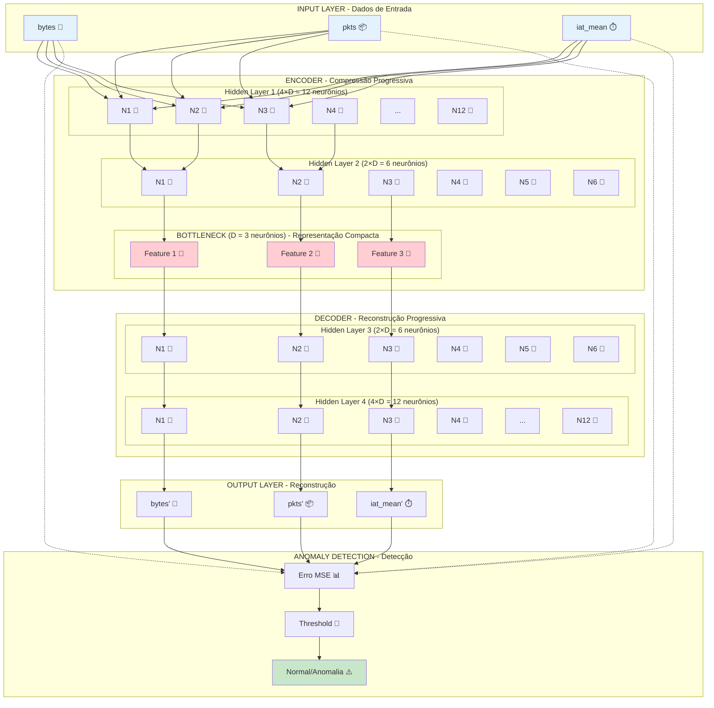
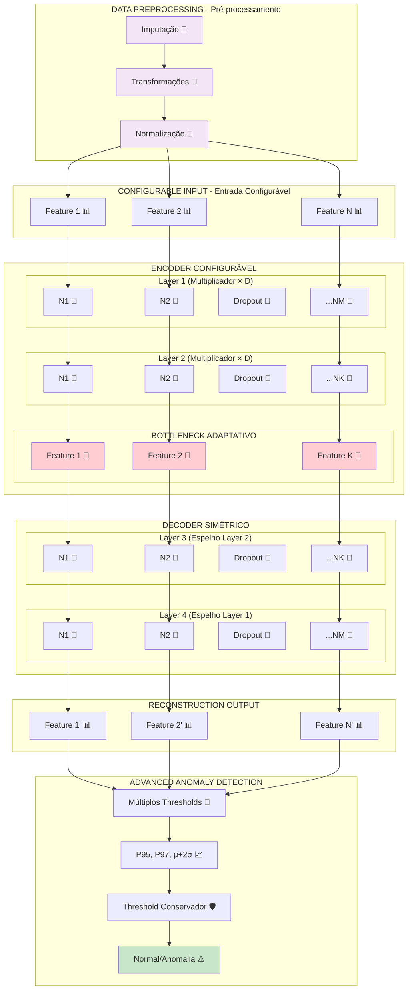
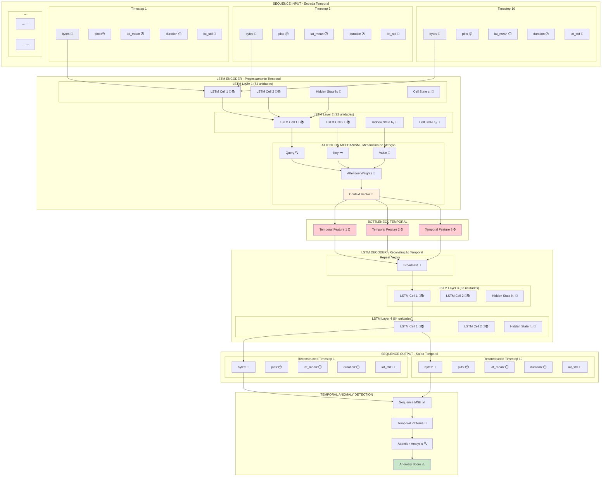

# Arquiteturas Neurais dos Modelos - Representação como Neurônios Reais

## Modelo V1 - Autoencoder Básico

## Modelo V2/V3 - Pipeline Configurável

## Modelo V4 - LSTM-Attention Temporal

## Comparação de Processamento Neural

### Modelo V1-V3: Processamento Pontual
- **Entrada**: 1 fluxo → 3-5 features
- **Processamento**: Neurônios densos com ativação ReLU
- **Memória**: Sem memória temporal
- **Detecção**: Erro de reconstrução instantâneo

### Modelo V4: Processamento Temporal
- **Entrada**: Sequência de 10 fluxos → 50 features temporais
- **Processamento**: LSTM cells com gates (forget, input, output)
- **Memória**: Hidden states + Cell states para contexto temporal
- **Atenção**: Foco dinâmico em timesteps relevantes
- **Detecção**: Padrões temporais anômalos

## Analogia com Neurônios Reais

### Neurônios Densos (V1-V3)
- 🧠 **Como neurônios simples**: Recebem sinais, processam com função de ativação
- ⚡ **Sinapses**: Pesos conectam todas as entradas a todas as saídas
- 🔄 **Processamento**: Instantâneo, sem memória

### LSTM Cells (V4)
- 🧠📚 **Como neurônios com memória**: Mantêm informação ao longo do tempo
- 🚪 **Gates**: Controlam fluxo de informação (como canais iônicos)
- 📖 **Cell State**: Memória de longo prazo (como potencial de repouso)
- 🧭 **Hidden State**: Memória de curto prazo (como potencial de ação)

### Attention Mechanism (V4)
- 🔍 **Como atenção seletiva**: Foca em informações relevantes
- 🎯 **Pesos de atenção**: Determina importância de cada timestep
- 🌟 **Context vector**: Resumo ponderado das informações importantes